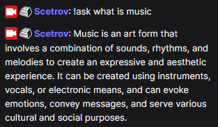
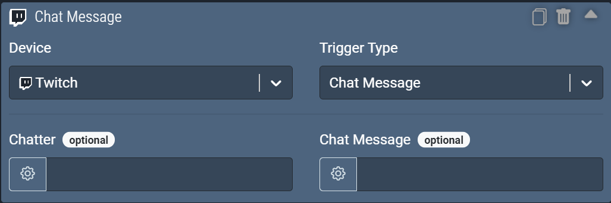
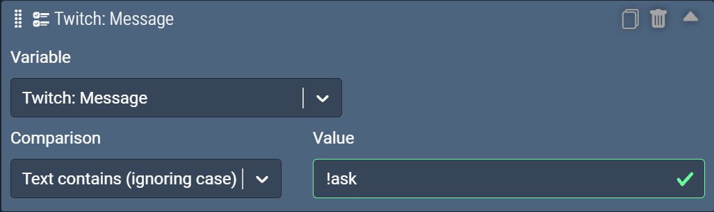
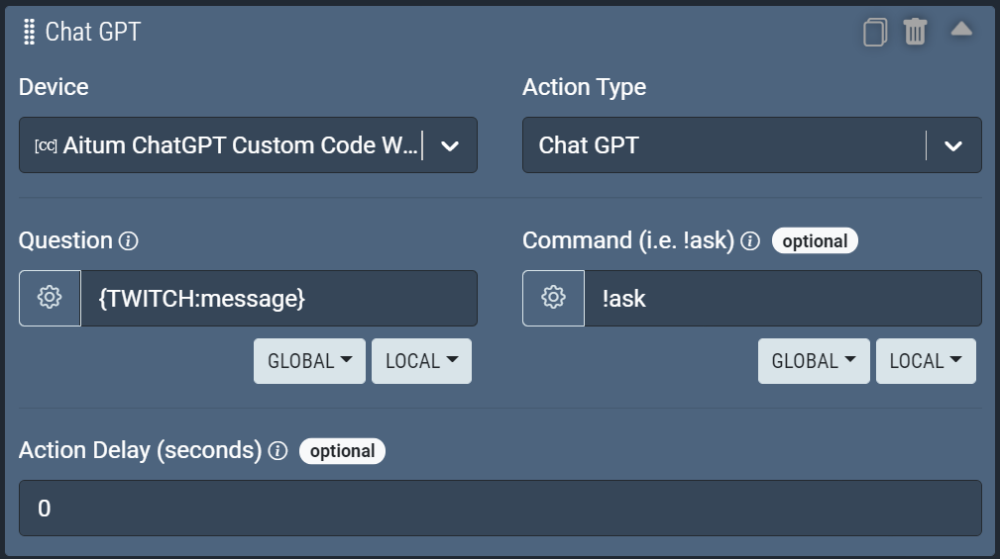

# aitum-cc-chatgpt
Aitum's Custom Code Wrapper for Chat GPT

An example of how to integrate Aitum with Chat GPT to provide a `!ask` command in chat, you can also use it to display responses in your OBS Overlay!



## Installation
Make sure you have NodeJS installed on your computer, which you can install from [here](https://nodejs.org/en/).

Clone or download (via the green button near the top right of this page > Download ZIP) this repository into a suitable place on your computer.

Open the folder up in your IDE.

Open up an integrated terminal or equivalent and install the dependencies:
```
npm i
```

After installing dependencies, run the following to generate your `settings.env` file.
```
npm run setup
```
This creates a `settings.env` file at the root directory of the project.

Edit your `settings.env` to customise the name you want for this CC instance and to include your APIKey from within Aitum.
The API Key can be found from within Settings > Aitum Settings > API Key.

## Getting started

Now that you're all set up, let's get the environment running.

Just to ensure you've got the latest versions of aitum.js and the CC lib, run:
```
npm run upgrade
```

The CC environment is build with rapid iteration in mind and thus we've chosen to **always hot reload** on code changes.

To run the wrapper:
```
npm run start
```

The wrapper will automatically find the Aitum master on your network and attempt to connect.

If there are any issues connecting, they will be logged to your terminal.

### Getting Started with ChatGPT

You will need an OpenAI API Key from here: https://platform.openai.com/account/api-keys

This needs to be added in

```
AITUM_CC_ID=...
AITUM_CC_HOST=...
API_KEY=...
OPENAI_API_KEY=[OPENAI API KEY Goes Here]
```

## Creating the rule

Any trigger that supports some form of text input exposed as an Aitum variable could be used. In this example, I have used a **Chat Message** from the **Twitch** device.

### Trigger



### Checks

This example only checks that the rule contains the `!ask` command, however, you can add other checks to require VIP or Broadcaster roles.



### Actions

NOTE: there are two actions included, one uses the official OpenAI npm package and one uses a 3rd party package; both do the same thing in slightly different ways.

The PoC uses two parameters:

 - **Question**: the question posed to ChatGPT
 - **Command**: command used in Checks, this will be stripped out from the beginning of the message



## Conversational Interface

The PoC could be extended further with a dictionary of previous responses to allow individual chatters to have a conversation with ChatGPT.